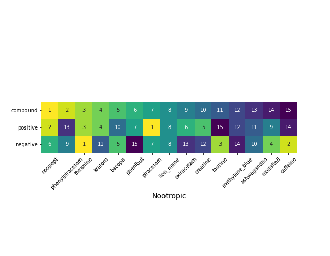

### Module goals:
- Implement natural language processing fundamentals 
- Apply dimensionality reduction techniques and visualizations, including PCA and t-SNE
- Utilize and compare unsupervised learning algorithms 

# Understanding Nootropics via Natural Language Processing

Determined which nootropics had the greatest positive, negative and overall sentiment using natural language processing, dimensionality reduction, and sentiment analysis. 

Figure: Heatmap of nootropics indicating their rank in terms of positive sentiment, negative sentiment (note that the least negative is ranked as 1), and compound sentiment. 

### Tools used: 
 - Pandas, matplotlib, seaborn
 - NLTK, spaCy, CoRex for natural language processing
 - PSAW to access large amounts of reddit data)
 - Textblob and VADER for sentiment analysis

### Data accessed:
 - Nootropics subreddit