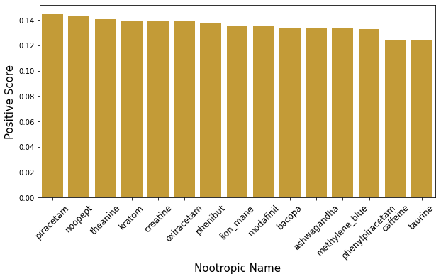

Emily Lorenzen

Metis Bootcamp - NLP Unsupervised Learning

06/25/2021

# Understanding nootropic use through natural language processing

## Abstract 

## Data

Data was obtained from the nootropics subreddit - https://www.reddit.com/r/Nootropics/.

## Tools and algorithms

### Data acquisition and cleanup

All posts on the nootropics subreddit with a score >25 were gathered using the python package PSAW. This provided me with a corpus of about ~6000 documents. 

Data was loaded into a pandas dataframe for cleaning. 

### Preprocessing, vectorizing, dimensionality reduction

The corprus was preprocessed by removing apostrophes, filtering out any non-alphabet characters, making all words lowercase, removing \n and deleting words that provide little information in this context.

The preprocesssed corpus was vectorized with count vectorization and term frequency - inverse document frequency. 

Topic modeling was used to reduce dimensionality. LSA, NMF, and LDA were performed for initial topic modeling. CoRex was used to grab 

### Clustering

t-SNE was used to visualize the data following dimensionality reduction. Kmeans was used to assign data points to a cluster. 

### Sentiment analysis

Both TextBlob and VADER were used to analyze sentiment.

## Results/design

### Word cloud

I first made a word cloud of my processed data. 

### Topic Modeling

I found that both LSA and NMF produced similar, and more sensible topics than LDA with the number of topics being three. The top words for the three topics were:

Topic  0
mg, day, like, ve, feel, just, sleep, caffeine, taking, anxiety

Topic  1
brain, cognitive, memory, study, pubmed, ncbi, nih, nlm, effects, gov

Topic  2
nootropics, nootropic, best, people, use, drugs, new, know, guys, reddit

After examining a few documents with strong weight in each topic, I determined that topic 0 was about experiences, topic 1 was about physiology and studies, and topic 2 was about advice. 

### t-SNE

I visualized the document data with the topic features using a T-SNE. 

The data points are not clearly clustering. 

### Kmeans clustering

I then attempted to cluster the data using k-means. 

Examining the data as three-dimensional plot shows that the data points do not form distinct clusters.

### Topic modeling on the nootropic-specific level

I was most interested in user experiences with the different nootropics, so I filtered the corpus for just documents that were identified as being max similarity to the experience topic. I then used CoRex with 14 nootropics as anchor words. The top words for each nootropics were:

0: caffeine,coffee,stimulant,drink,cup,cups,theacrine,jittery,jitters,caffeinated
1: phenibut,self,alcohol,medical,abuse,family,type,desire,despite,girlfriend
2: piracetam,racetams,skills,amounts,tend,extended,intensity,content,motor,fluidity
3: mane,lion,lions,sunday,track,strange,word,uncomfortable,usage,hopefully
4: ashwagandha,ksm,thyroid,frequently,empathy,cortisol,sweating,herb,chill,definition
5: noopept,dose,taken,questions,nootropic,choline,overall,doses,dosing,aniracetam
6: theanine,combo,suntheanine,valerian,ashwaghanda,brush,dozen,occasion,ratio,espresso
7: bacopa,post,positive,interesting,short,likely,results,does,term,important
8: phenylpiracetam,try,later,use,working,using,hour,increased,motivation,somewhat
9: modafinil,armodafinil,pill,pop,maintain,moda,unknown,price,net,plays
10: creatine,things,mind,sleep,mental,energy,memory,daily,exercise,sense
11: kratom,brain,start,probably,drugs,problems,research,increase,makes,slightly
12: oxiracetam,did,like,day,time,feel,felt,just,nootropics,started
13: taurine,trying,head,acid,information,ncbi,nih,gov,nlm,process
14: blue,good,people,little,make,hard,body,bit,different,having

### Sentiment analysis of each nootropic

I then performed sentiment analysis for each nootropics using both textblob and Vader. Using textblob all the nootropics showed very similar sentiment. However, VADER is a better sentiment analyzer for social media and showed more disparity between nootropics. 

## Communication

Results were presented on June 25, 2021 to colleagues in the Metis data science bootcamp. Code is available is at https://www.github.com/emilylorenzen/metis-unsupervised